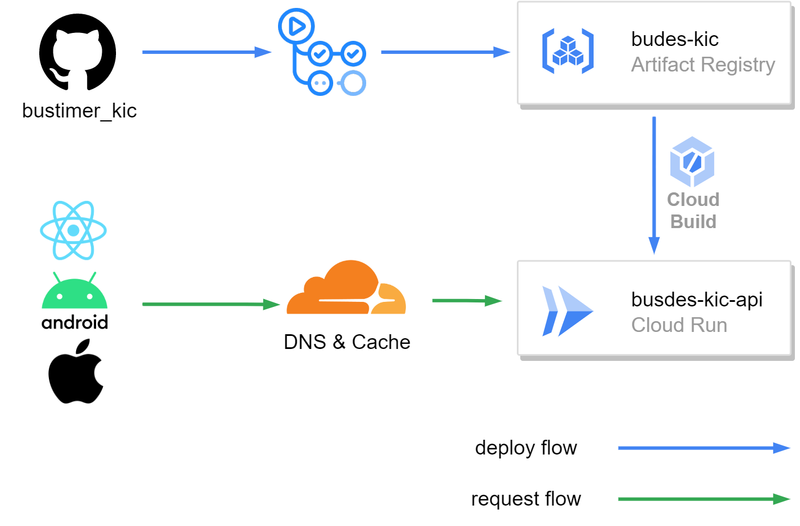

# busdes-kic-api(Japanese)
立命館大学衣笠キャンパスと駅を結ぶバス情報をリアルタイムに表示するアプリケーションです。
# 概要
## ライブラリ
* [echo](https://echo.labstack.com/)
* [colly](http://go-colly.org/)
* [go-cache](https://github.com/patrickmn/go-cache)
* [sqlite](https://github.com/mattn/go-sqlite3)
* [gorm](https://github.com/go-gorm/gorm)

## アーキテクチャ
* Clean Archtechture
    * Controller
    * Usecase
    * Repository
    * Domain

## エンドポイント
| endpoint         | query | description                                                          | 
| ---------------- | ----- | -------------------------------------------------------------------- | 
| /timetable       | fr(string),to(string) | frからtoに走っているバスのfr駅時刻表                                 | 
| /timetable/multi | fr(string),to(string) | frからtoに走っているバスのfr駅時刻表(frかtoに複数のバス停を指定可能) | 
| /nextbus         | fr(string),to(string) | frからtoに走るバスのfr駅の次に来るバスの情報(最大3個)                | 
# インフラ
## 使用環境
busdes-kic-apiは、GCPのCloudRun(Google Cloud Plateform)上で動作しています。また、DNSにはCloudFlareを使用しています。

* GCP
    * Cloud Run
* Cloud Flare
    * DNS

## CI/CD
このシステムでは、GithubActionsを使用して継続的なインティグレーションと継続的なデリバリーを実現しています。

### 本番環境

### 開発環境

# busdes-kic-api(English)
This application displays real-time bus information between Ritsumeikan University Kinugasa Campus and the station.

# overview
## Library
* [echo](https://echo.labstack.com/)
* [colly](http://go-colly.org/)
* [go-cache](https://github.com/patrickmn/go-cache)
* [sqlite](https://github.com/mattn/go-sqlite3)
* [gorm](https://github.com/go-gorm/gorm)

# architecture
* Clean Archtechture
    * Controller
    * Usecase
    * Repository
    * Domain

## Endpoint
| endpoint         | query                 | description                                                                                                              | 
| ---------------- | --------------------- | ------------------------------------------------------------------------------------------------------------------------ | 
| /timetable       | fr(string),to(string) | Bus stop (fr) timetable for buses running from (fr) to (to)                                                              | 
| /timetable/multi | fr(string),to(string) | Timetable of bus stops (fr) for buses running from (fr) to (to) (multiple bus stops can be specified by either fr or to) | 
| /nextbus         | fr(string),to(string) | Information on the next bus (max 3 buses) coming to (fr) station for buses from (fr) to (to)                             | 

# Infra
## environment
This System is running on GCP's CloudRun(Google Cloud Plateform). And we use CloudFlare for DNS.

* GCP
    * Cloud Run
* Cloud Flare
    * DNS

## CI/CD
The system uses GithubActions for continuous intigration and continuous delivery.

### Production

### Development
