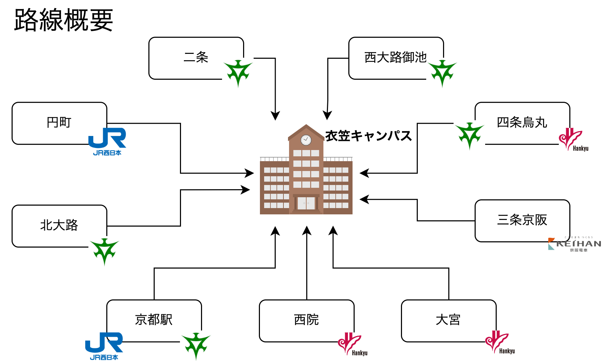
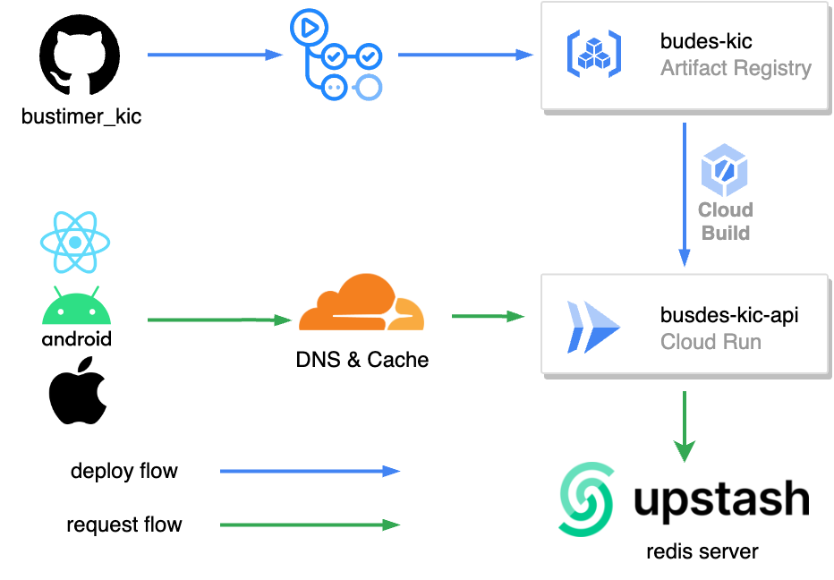
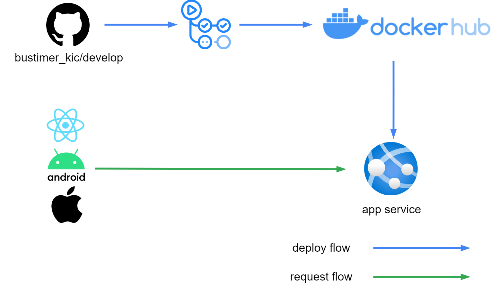

<h1 align="center"> Busdes-KIC</h1>

# 概要
立命館大学衣笠キャンパスと駅を結ぶバス情報をリアルタイムに表示するアプリケーションです。
## 言語
* [Go](https://go.dev/)
    * Supported Versions (Go 1.9 ～) ※このバージョンより古いものに関しては動作確認していません
## ライブラリ
* [echo](https://echo.labstack.com/) (Http Client)
* [colly](http://go-colly.org/) (Scraping)
* [go-cache](https://github.com/patrickmn/go-cache)(Cache Library)
* [sqlite](https://github.com/mattn/go-sqlite3) (Database Library)

## ツール
* [sqlc](https://sqlc.dev/)(SQL Query Builder)

## アーキテクチャ
* Clean Archtechture
    * Controller
    * Usecase
    * Repository
    * Domain

## エンドポイント
| endpoint         | query | description                                                          | 
| ---------------- | ----- | -------------------------------------------------------------------- | 
| /timetable       | fr(string),to(string) | frからtoに走っているバスのfr駅時刻表                                 | 
| /timetable/multi | fr(string),to(string) | frからtoに走っているバスのfr駅時刻表(frかtoに複数のバス停を指定可能) | 
| /nextbus         | fr(string),to(string) | frからtoに走るバスのfr駅の次に来るバスの情報(最大3個)                | 

## 路線図

# インフラ
## 使用環境
### 本番環境
busdes-kic-apiは、GCPのCloudRun(Google Cloud Plateform)上で動作しています。また、DNSにはCloudFlareを使用しています。

* GCP
    * Cloud Run
* Cloud Flare
    * DNS

### 開発環境
開発環境ではAzureのApp ServiceにDocker ContainerをDeployしています。
* Azure
    * App Service
* Docker Hub

## CI/CD
このシステムでは、GithubActionsを使用して継続的なインティグレーションと継続的なデリバリーを実現しています。

### 本番環境

### 開発環境

### Test Coverage
[codecove.io](https://about.codecov.io/)を用いることでTestのcoverageを計測しREADMEに掲載しています。

# 開発環境
## Github レポジトリ
* [Backend Repository(Public)](https://github.com/mercy34mercy/bustimer_kic)
* [Android Application Repository(Private)](https://github.com/mercy34mercy/bus-des-kic-android)
* [iOS Application Repository(Public)](https://github.com/kuro48/BusdesKICNativeiOS)
* [Web Application Repository(Public)](https://github.com/Shunkicreate/busdes-kic-web)
## Git Flow
I referred to this [article](https://qiita.com/KosukeSone/items/514dd24828b485c69a05)

* main
    * develop
        * feat/***
        * fix/***
## Contributor
* Backend
    * [mercy34mercy](https://github.com/mercy34mercy)
* Android
    * [mercy34mercy](https://github.com/mercy34mercy)
* iOS
    * [kuro48](https://github.com/kuro48)
    * [shinpochi2002](https://github.com/shinpochi2002)
* Web
    * [Shunkicreate](https://github.com/Shunkicreate)
    * [Kyororillex](https://github.com/Kyororillex)
    * [YukaChoco](https://github.com/YukaChoco)
* Designer
    * [chell-uoxou](https://github.com/chell-uoxou)
    * [F-mm1229](https://github.com/F-mm1229)

## 組織概要
私たちは、立命館大学を中心に活動するIT学生団体[watnow](http://www.watnow.jp/)です。\
watnowのメンバー5名で、2022/9～ backend,iOS,Androidアプリの開発を進めています。また、2022/12～はWeb開発メンバーも加わり計8名でBudes-KICの開発を行っています。

# 他プロジェクト

Busdes!は立命館大学びわこ草津キャンパスと南草津駅をつなぐバスの時刻表アプリです。\
このアプリも学生団体watnowで開発し運営しています。
* [Androidアプリ](https://play.google.com/store/apps/details?id=busdes.rits.jp&hl=ja&gl=US&pli=1)
* [iOSアプリ](https://apps.apple.com/jp/app/busdes-%E3%83%90%E3%82%B9%E3%81%A7%E3%81%99/id1491015874) 

# overview
This application displays real-time bus information between Ritsumeikan University Kinugasa Campus and the station.

## Languages
* [Go](https://go.dev/)
    * Supported Versions (Go 1.9 ～) ※We have not checked the operation of older versions.
## Library
* [echo](https://echo.labstack.com/) (Http Client)
* [colly](http://go-colly.org/) (Scraping)
* [go-cache](https://github.com/patrickmn/go-cache)(Cache Library)
* [sqlite](https://github.com/mattn/go-sqlite3) (Database Library)

## tool
* [sqlc](https://sqlc.dev/) (SQL Query Builder)

## architecture
* Clean Archtechture
    * Controller
    * Usecase
    * Repository
    * Domain

## Endpoint
| endpoint         | query                 | description                                                                                                              | 
| ---------------- | --------------------- | ------------------------------------------------------------------------------------------------------------------------ | 
| /timetable       | fr(string),to(string) | Bus stop (fr) timetable for buses running from (fr) to (to)                                                              | 
| /timetable/multi | fr(string),to(string) | Timetable of bus stops (fr) for buses running from (fr) to (to) (multiple bus stops can be specified by either fr or to) | 
| /nextbus         | fr(string),to(string) | Information on the next bus (max 3 buses) coming to (fr) station for buses from (fr) to (to)                             | 

## route map

# Infra
## environment
### Production
This System is running on GCP's CloudRun(Google Cloud Plateform). And we use CloudFlare for DNS.

* GCP
    * Cloud Run
* Cloud Flare
    * DNS
### Development
In the development environment, Docker Container is Deployed to Azure's App Service.

* Azure
    * App Service
* Docker Hub

## CI/CD
The system uses GithubActions for continuous intigration and continuous delivery.

### Production

### Development

### Test Coverage
The Test coverage is measured by using [codecove.io](https://about.codecov.io/) and posted in the README.

# Development Overview
## Github Repository
* [Backend Repository(Public)](https://github.com/mercy34mercy/bustimer_kic)
* [Android Application Repository(Private)](https://github.com/mercy34mercy/bus-des-kic-android)
* [iOS Application Repository(Public)](https://github.com/kuro48/BusdesKICNativeiOS)
* [Web Application Repository(Public)](https://github.com/Shunkicreate/busdes-kic-web)
## Git Flow
I referred to this [article](https://qiita.com/KosukeSone/items/514dd24828b485c69a05)

* main
    * develop
        * feat/***
        * fix/***
## contributor
* Backend
    * [mercy34mercy](https://github.com/mercy34mercy)
* Android
    * [mercy34mercy](https://github.com/mercy34mercy)
* iOS
    * [kuro48](https://github.com/kuro48)
    * [shinpochi2002](https://github.com/shinpochi2002)
* Web
    * [Shunkicreate](https://github.com/Shunkicreate)
    * [Kyororillex](https://github.com/Kyororillex)
    * [YukaChoco](https://github.com/YukaChoco)
* Designer
    * [chell-uoxou](https://github.com/chell-uoxou)
    * [F-mm1229](https://github.com/F-mm1229)

## Organizational Profile
We are [watnow](http://www.watnow.jp/), an IT student group based in Ritsumeikan University. \
Five members of watnow are developing backend, iOS, and Android applications from 2022/9. Also, from 2022/12, 3 web app developers will join to develop Budes-KIC with a total of 8 members.

# Other Projects
 \
Busdes! is a bus schedule application connecting Ritsumeikan University Biwako Kusatsu Campus and Minami-Kusatsu Station. \
This application is also developed and operated by student group watnow.
* [Android Application](https://play.google.com/store/apps/details?id=busdes.rits.jp&hl=ja&gl=US&pli=1)
* [iOS Application](https://apps.apple.com/jp/app/busdes-%E3%83%90%E3%82%B9%E3%81%A7%E3%81%99/id1491015874) 